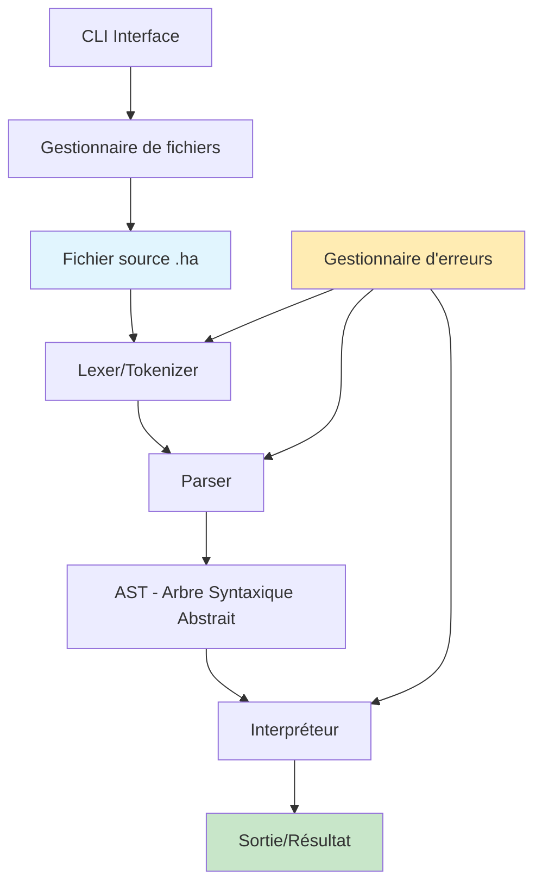
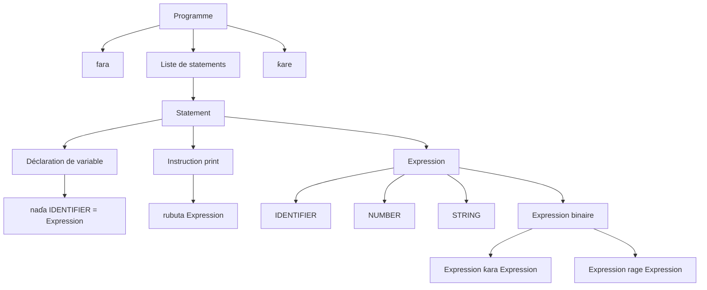
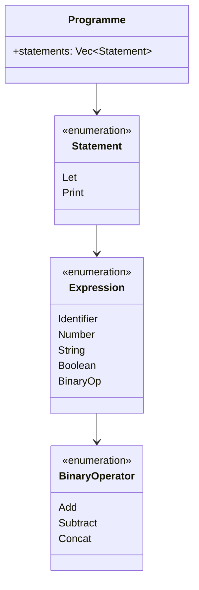
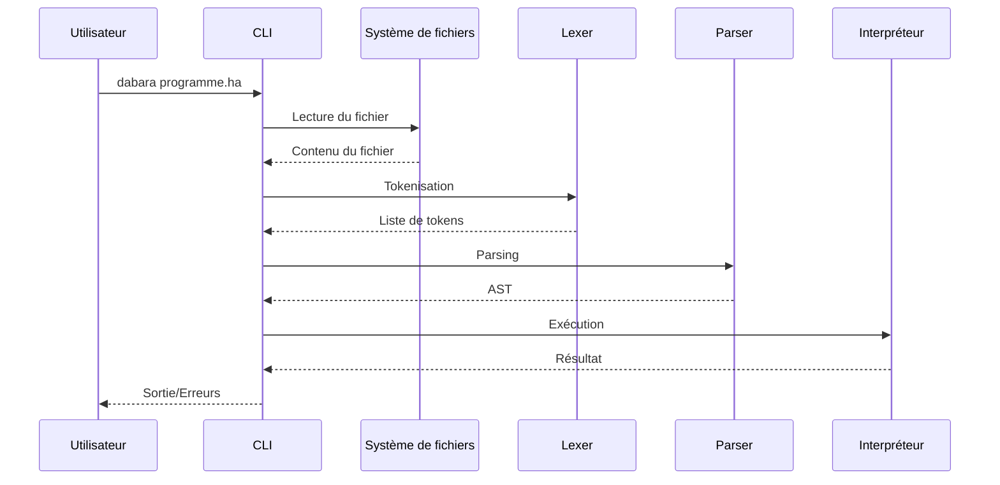
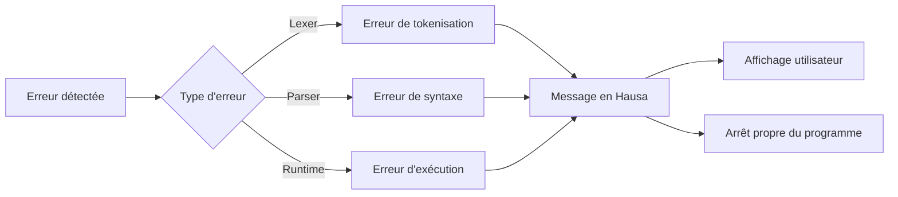
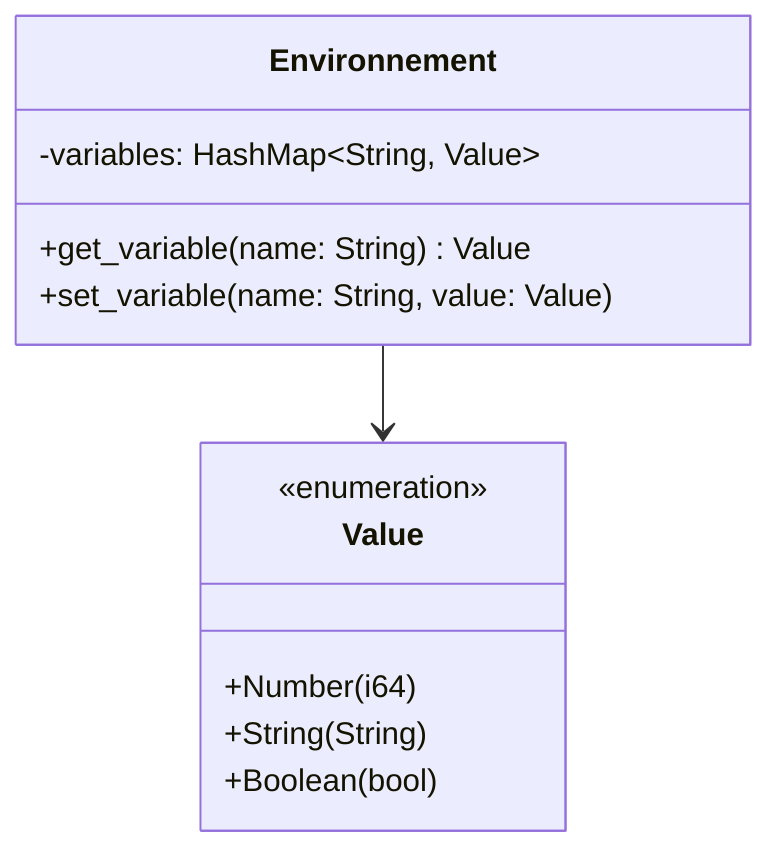

# Conception du Langage de Programmation Dabara v0.0.1

## Vue d'ensemble

Le projet Dabara vise à créer un langage de programmation fonctionnel et accessible utilisant la syntaxe Hausa. Cette version 0.0.1 constitue une preuve de concept démontrant la faisabilité d'un langage de programmation avec des mots-clés en langue locale, permettant aux locuteurs Hausa d'apprendre et d'utiliser la programmation dans leur langue maternelle.

### Objectifs stratégiques
- Démocratiser l'accès à la programmation pour les communautés Hausa
- Prouver la viabilité technique d'un langage avec syntaxe non-anglaise
- Créer une base solide pour l'expansion future du langage
- Établir un modèle pour d'autres langages de programmation localisés

### Valeur métier
- **Inclusion linguistique** : Réduction des barrières linguistiques dans l'apprentissage de la programmation
- **Innovation culturelle** : Premier langage de programmation utilisant la syntaxe Hausa
- **Impact éducatif** : Facilitation de l'enseignement de la programmation dans les régions Hausa
- **Modèle extensible** : Architecture permettant l'ajout de nouvelles fonctionnalités

## Architecture du système

### Architecture globale



### Composants principaux

| Composant | Responsabilité | Entrée | Sortie |
|-----------|----------------|--------|--------|
| **Lexer** | Tokenisation du code source | Code source Hausa | Liste de tokens |
| **Parser** | Construction de l'AST | Tokens | Arbre syntaxique abstrait |
| **Interpréteur** | Exécution du programme | AST | Résultat d'exécution |
| **CLI** | Interface utilisateur | Arguments de ligne de commande | Contrôle du flux d'exécution |
| **Gestionnaire d'erreurs** | Gestion des erreurs | Erreurs système | Messages d'erreur en Hausa |

## Spécification du langage

### Système de mots-clés

Le langage Dabara utilise 8 mots-clés fondamentaux en Hausa :

| Mot-clé Hausa | Équivalent anglais | Token | Usage |
|---------------|-------------------|-------|-------|
| `fara` | begin | BEGIN | Début de programme |
| `ƙare` | end | END | Fin de programme |
| `rubuta` | print | PRINT | Affichage de données |
| `naɗa` | let/define | LET | Déclaration de variable |
| `gaskiya` | true | TRUE | Valeur booléenne vraie |
| `karya` | false | FALSE | Valeur booléenne fausse |
| `ƙara` | add | PLUS | Opérateur d'addition |
| `rage` | subtract | MINUS | Opérateur de soustraction |

### Tokens additionnels

| Type de Token | Description | Exemples |
|---------------|-------------|----------|
| IDENTIFIER | Noms de variables | `sunan`, `lambar` |
| NUMBER | Nombres entiers | `5`, `42`, `100` |
| STRING | Chaînes de caractères | `"Sannu"`, `"Ahmad"` |
| EQUALS | Opérateur d'assignation | `=` |
| NEWLINE | Saut de ligne | `\n` |

### Grammaire du langage



## Architecture des composants

### Composant Lexer

**Responsabilités :**
- Reconnaissance des caractères Unicode Hausa (ɓ, ɗ, ƙ, etc.)
- Tokenisation des mots-clés et identificateurs
- Gestion des littéraux (nombres, chaînes)
- Filtrage des espaces (conservation des sauts de ligne)

**Flux de traitement :**
1. Lecture caractère par caractère du code source
2. Reconnaissance des motifs (mots-clés, nombres, chaînes)
3. Génération des tokens correspondants
4. Gestion des erreurs de tokenisation

### Composant Parser

**Responsabilités :**
- Construction de l'arbre syntaxique abstrait (AST)
- Validation de la syntaxe du programme
- Gestion des erreurs de syntaxe
- Support des expressions imbriquées

**Structure de l'AST :**



### Composant Interpréteur

**Responsabilités :**
- Exécution des instructions de l'AST
- Gestion de l'environnement des variables
- Évaluation des expressions
- Gestion de la sortie du programme

**Gestion des valeurs :**

| Type de valeur | Stockage | Opérations supportées |
|----------------|----------|----------------------|
| Number(i64) | Variables HashMap | Addition, soustraction |
| String | Variables HashMap | Concaténation |
| Boolean | Variables HashMap | Évaluation logique |

**Flux d'exécution :**
1. Parcours séquentiel des statements
2. Évaluation des expressions selon leur type
3. Mise à jour de l'environnement des variables
4. Affichage des résultats via print

### Interface CLI

**Architecture de commande :**
- Utilisation de la bibliothèque `clap` pour le parsing des arguments
- Support du format : `dabara fichier.ha`
- Gestion des erreurs de fichier avec messages en Hausa
- Intégration du pipeline lexer → parser → interpréteur

**Flux de traitement CLI :**



## Gestion des erreurs

### Stratégie de gestion d'erreurs

Le système d'erreurs utilise une approche hiérarchique avec messages localisés en Hausa :

| Type d'erreur | Contexte | Message type |
|---------------|----------|--------------|
| LexError | Tokenisation | "Kuskure: Ba a gane kalmar..." |
| ParseError | Analyse syntaxique | "Kuskure: Ana tsammanin..." |
| RuntimeError | Exécution | "Kuskure: Babu irin wannan mai canjin..." |

### Flux de gestion d'erreurs



## Modèle de données

### Structure des variables

L'interpréteur maintient un environnement de variables basé sur une HashMap :

| Clé | Valeur | Description |
|-----|--------|-------------|
| String (nom variable) | Value (enum) | Association nom-valeur |

### Types de données supportés



## Stratégie de test

### Tests d'intégration

| Cas de test | Description | Résultat attendu |
|-------------|-------------|------------------|
| hello_world | Programme simple d'affichage | "Sannu duniya!" |
| variables | Déclaration et utilisation de variables | Affichage correct des valeurs |
| arithmetic | Opérations arithmétiques de base | Calculs corrects |
| string_concat | Concaténation de chaînes | Chaînes combinées correctement |
| error_handling | Gestion des erreurs diverses | Messages d'erreur en Hausa |

### Tests unitaires

- **Lexer** : Vérification de la tokenisation correcte
- **Parser** : Validation de la construction d'AST
- **Interpréteur** : Tests d'exécution des opérations
- **Gestion d'erreurs** : Validation des messages d'erreur

## Exemples de programmes

### Programme de base (hello.ha)
```
fara
  rubuta "Sannu! Ina kwana?"
ƙare
```

### Programme avec variables (variables.ha)
```
fara
  naɗa sunan = "Khadija"
  naɗa shekarun = 25
  rubuta "Sunanta: " + sunan
  rubuta "Shekarunta: "
  rubuta shekarun
ƙare
```

### Programme arithmétique (math.ha)
```
fara
  naɗa lambar1 = 10
  naɗa lambar2 = 5
  naɗa jimla = lambar1 ƙara lambar2
  naɗa bambanci = lambar1 rage lambar2
  
  rubuta "Jimla: "
  rubuta jimla
  rubuta "Bambanci: "
  rubuta bambanci
ƙare
```

## Configuration du projet

### Structure des fichiers

```
dabara/
├── src/
│   ├── main.rs           # Point d'entrée CLI
│   ├── lexer.rs          # Composant de tokenisation
│   ├── parser.rs         # Analyseur syntaxique
│   ├── interpreter.rs    # Moteur d'exécution
│   ├── error.rs          # Gestion des erreurs
│   └── lib.rs           # Déclarations de modules
├── examples/
│   ├── hello.ha         # Programmes d'exemple
│   ├── variables.ha
│   └── math.ha
├── tests/
│   └── integration_tests.rs
├── Cargo.toml           # Configuration Rust
└── README.md           # Documentation utilisateur
```

### Dépendances techniques

| Dépendance | Version | Usage |
|------------|---------|-------|
| clap | 4.0+ | Interface de ligne de commande |
| Standard Library | - | Collections, I/O, gestion d'erreurs |

## Critères de succès

### Exigences fonctionnelles
- Tokenisation correcte des 8 mots-clés Hausa
- Support complet des caractères Unicode Hausa
- Exécution correcte des déclarations de variables
- Fonctionnement des instructions d'affichage
- Opérations arithmétiques de base fonctionnelles
- Concaténation de chaînes opérationnelle
- Gestion complète de l'environnement des variables
- Messages d'erreur entièrement en Hausa

### Exigences techniques
- Compilation sans avertissements
- Passage de tous les tests automatisés
- Interface CLI fonctionnelle pour fichiers .ha
- Gestion d'erreurs robuste sans paniques
- Code documenté et maintenable
- Compatibilité multi-plateforme

### Exigences d'expérience utilisateur
- Exécution fluide via `dabara hello.ha`
- Messages d'erreur clairs et informatifs
- Exemples fonctionnels et démonstrables
- Installation simple via `cargo install --path .`