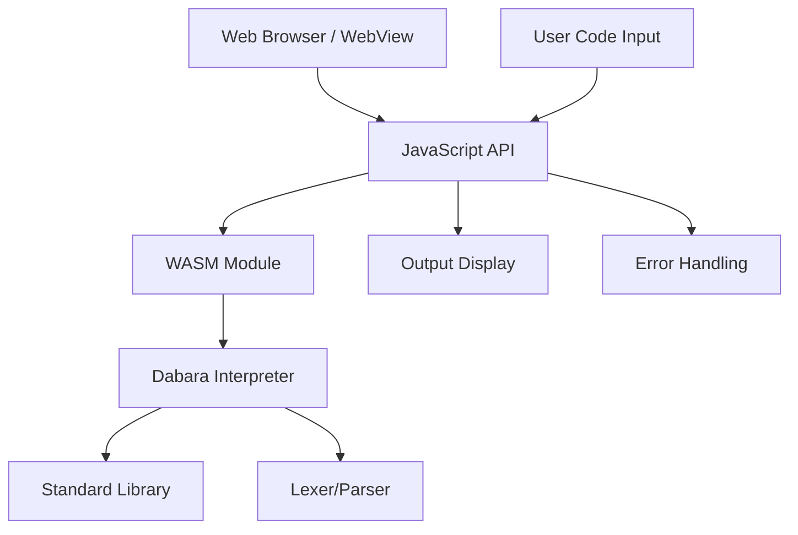

# Dabara WASM Roadmap: Web and WebView Support

**Created**: 2026-01-21
**Target**: Enable running Dabara code in browsers and WebViews
**Timeline**: 4-6 weeks

---

## Executive Summary

**Current State**: Dabara v0.2.0 is a native Rust interpreter with CLI interface
**Goal**: Compile interpreter to WebAssembly for web browsers and mobile WebViews
**Benefits**:
- ✅ Cross-platform execution (web, Android, iOS)
- ✅ No installation required
- ✅ Easy distribution and updates
- ✅ Reuse existing Rust codebase

---

## Architecture Overview



**Key Components**:
- **WASM Module**: Compiled Rust interpreter
- **JavaScript API**: Bridge between web and WASM
- **Web Interface**: Code editor and output display
- **WebView Integration**: For mobile apps

---

## Phase 1: WASM Core Implementation (2-3 weeks)

### 1.1 Setup WASM Build Environment
**Priority**: CRITICAL
**Timeline**: 2-3 days

**Tasks**:
- [ ] Install wasm-pack globally
- [ ] Add wasm32-unknown-unknown target to Rust
- [ ] Update Cargo.toml with WASM dependencies
- [ ] Configure release optimizations for WASM

**Dependencies to Add**:
```toml
[dependencies]
wasm-bindgen = "0.2"
js-sys = "0.3"
web-sys = "0.3"

[dependencies.web-sys]
version = "0.3"
features = [
  "console",
  "Window",
  "Document",
  "Element",
  "HtmlElement",
  "HtmlTextAreaElement",
  "EventTarget",
  "Event",
]
```

### 1.2 Create WASM Bindings
**Priority**: CRITICAL
**Timeline**: 1 week

**Current Issues**:
- Interpreter uses `std::io::Write` for output
- File system access not available in WASM
- Need string-based I/O

**Required Changes**:

#### Modify Interpreter for WASM
```rust
// src/interpreter.rs - Add WASM-compatible output
pub struct WasmInterpreter {
    pub interpreter: Interpreter,
    pub output: String,
}

impl WasmInterpreter {
    pub fn new() -> Self {
        Self {
            interpreter: Interpreter::new(),
            output: String::new(),
        }
    }

    pub fn run(&mut self, source: &str) -> Result<(), Error> {
        // Capture output instead of printing
        self.output.clear();
        // ... existing logic but write to self.output
    }
}
```

#### Create WASM Module
```rust
// src/wasm.rs (new file)
use wasm_bindgen::prelude::*;
use crate::{tokenize, parse, WasmInterpreter, Error};

#[wasm_bindgen]
pub struct DabaraRuntime {
    interpreter: WasmInterpreter,
}

#[wasm_bindgen]
impl DabaraRuntime {
    #[wasm_bindgen(constructor)]
    pub fn new() -> DabaraRuntime {
        DabaraRuntime {
            interpreter: WasmInterpreter::new(),
        }
    }

    #[wasm_bindgen]
    pub fn run_code(&mut self, source: &str) -> Result<String, JsValue> {
        self.interpreter.run(source)
            .map(|_| self.interpreter.output.clone())
            .map_err(|e| JsValue::from_str(&e.to_string()))
    }

    #[wasm_bindgen]
    pub fn tokenize(&self, source: &str) -> Result<JsValue, JsValue> {
        // Return tokens as JSON
    }

    #[wasm_bindgen]
    pub fn parse(&self, source: &str) -> Result<JsValue, JsValue> {
        // Return AST as JSON
    }
}
```

**Files to Create/Modify**:
- `src/wasm.rs` (new)
- `src/interpreter.rs` - Add WasmInterpreter
- `src/lib.rs` - Export WASM types
- `Cargo.toml` - Add WASM features

### 1.3 Handle Standard Library Compatibility
**Priority**: HIGH
**Timeline**: 3-4 days

**Issues**:
- Some stdlib functions may use incompatible APIs
- Random number generation
- Time/date functions

**Solutions**:
- Use web-sys for browser APIs where needed
- Provide WASM-specific implementations
- Graceful degradation for unsupported features

### 1.4 Build and Test WASM Module
**Priority**: CRITICAL
**Timeline**: 2-3 days

**Build Process**:
```bash
# Build WASM
wasm-pack build --target web --out-dir pkg

# Test locally
cd pkg
python3 -m http.server 8000
# Open browser to test
```

**Testing Requirements**:
- [ ] Basic code execution works
- [ ] Output capture functions
- [ ] Error handling
- [ ] Standard library functions
- [ ] Performance benchmarks vs native

---

## Phase 2: Web Interface Development (2-3 weeks)

### 2.1 Create Basic Web Playground
**Priority**: HIGH
**Timeline**: 1 week

**Features**:
- Code editor (textarea initially, upgrade to CodeMirror)
- Run button
- Output display area
- Error messages
- Basic styling

**HTML Structure**:
```html
<!DOCTYPE html>
<html lang="en">
<head>
    <meta charset="UTF-8">
    <title>Dabara Web Playground</title>
    <link rel="stylesheet" href="styles.css">
</head>
<body>
    <div class="container">
        <h1>Dabara Playground</h1>
        <div class="editor-section">
            <textarea id="code-editor" placeholder="Write Dabara code here..."></textarea>
            <button id="run-btn">Run Code (Gudanar)</button>
        </div>
        <div class="output-section">
            <h3>Output:</h3>
            <pre id="output"></pre>
        </div>
    </div>
    <script type="module" src="app.js"></script>
</body>
</html>
```

**JavaScript API**:
```javascript
// app.js
import init, { DabaraRuntime } from './pkg/dabara.js';

let runtime;

async function initDabara() {
    await init();
    runtime = new DabaraRuntime();
}

async function runCode() {
    const code = document.getElementById('code-editor').value;
    const output = document.getElementById('output');

    try {
        const result = runtime.run_code(code);
        output.textContent = result;
    } catch (error) {
        output.textContent = `Error: ${error}`;
    }
}

// Initialize
initDabara();

// Event listeners
document.getElementById('run-btn').addEventListener('click', runCode);
```

### 2.2 Add Advanced Editor Features
**Priority**: MEDIUM
**Timeline**: 3-4 days

**Enhancements**:
- Syntax highlighting (CodeMirror or Monaco)
- Line numbers
- Error highlighting
- Auto-completion (basic keywords)
- Keyboard shortcuts (Ctrl+Enter to run)

### 2.3 Implement Example Programs
**Priority**: MEDIUM
**Timeline**: 2-3 days

**Features**:
- Dropdown with sample programs
- Load example on selection
- Include tutorials and basic programs

### 2.4 Add Offline Support
**Priority**: MEDIUM
**Timeline**: 2-3 days

**Features**:
- Service worker for caching
- Offline code editing
- Local storage for code snippets

---

## Phase 3: WebView Integration (1-2 weeks)

### 3.1 Android WebView Setup
**Priority**: HIGH
**Timeline**: 1 week

**Requirements**:
- Embed web interface in Android app
- Access to device features (file system, camera)
- Native UI integration

**Implementation**:
```kotlin
// Android WebView setup
webView.settings.apply {
    javaScriptEnabled = true
    domStorageEnabled = true
    allowFileAccess = true
}

// Load WASM playground
webView.loadUrl("file:///android_asset/dabara-playground.html")
```

### 3.2 iOS WKWebView Setup
**Priority**: MEDIUM
**Timeline**: 3-4 days

**Similar to Android but using WKWebView**

### 3.3 Cross-Platform Considerations
**Priority**: MEDIUM
**Timeline**: 2-3 days

**Handle differences**:
- File access permissions
- Native UI integration
- Platform-specific features

---

## Phase 4: Testing and Optimization (1 week)

### 4.1 Comprehensive Testing
**Priority**: CRITICAL
**Timeline**: 3-4 days

**Test Categories**:
- Unit tests for WASM bindings
- Integration tests for web interface
- Cross-browser compatibility
- WebView testing on devices

### 4.2 Performance Optimization
**Priority**: HIGH
**Timeline**: 2-3 days

**Optimizations**:
- Minimize WASM binary size
- Optimize interpreter for WASM
- Lazy loading of stdlib
- Memory management

### 4.3 Documentation
**Priority**: MEDIUM
**Timeline**: 1-2 days

**Deliverables**:
- WASM API documentation
- Web integration guide
- Deployment instructions

---

## Implementation Timeline

### Week 1-2: Core WASM
- [ ] Setup build environment
- [ ] Create WASM bindings
- [ ] Modify interpreter for string I/O
- [ ] Build and test basic functionality

### Week 3-4: Web Interface
- [ ] Basic playground HTML/JS
- [ ] Advanced editor features
- [ ] Example programs
- [ ] Offline support

### Week 5-6: Integration & Polish
- [ ] WebView integration
- [ ] Cross-platform testing
- [ ] Performance optimization
- [ ] Documentation

---

## Success Criteria

### Functional Requirements
- [ ] Execute basic Dabara programs in browser
- [ ] Display output correctly
- [ ] Handle errors gracefully
- [ ] Support standard library functions
- [ ] Work in WebView on mobile

### Performance Requirements
- [ ] WASM binary < 2MB
- [ ] Code execution < 100ms for simple programs
- [ ] Memory usage < 50MB
- [ ] Compatible with ES2017+ browsers

### Quality Requirements
- [ ] 95%+ test coverage for WASM code
- [ ] Cross-browser testing (Chrome, Firefox, Safari, Edge)
- [ ] Mobile WebView testing (Android 7+, iOS 12+)
- [ ] Accessibility compliance (WCAG 2.1 AA)

---

## Risks and Mitigations

### Technical Risks
- **WASM Compatibility**: Some Rust features may not work in WASM
  - *Mitigation*: Test early, use wasm-bindgen documentation

- **Performance**: Interpreter may be slow in browser
  - *Mitigation*: Profile and optimize hot paths

- **Browser Differences**: Inconsistent behavior across browsers
  - *Mitigation*: Use web-sys for standardized APIs

### Project Risks
- **Scope Creep**: Adding too many web features
  - *Mitigation*: Stick to core playground functionality

- **Dependency Issues**: WASM ecosystem changes
  - *Mitigation*: Pin versions, regular updates

---

## Dependencies and Prerequisites

### Required Tools
- Rust 1.70+
- wasm-pack 0.12+
- Node.js 16+ (for web tooling)
- Android Studio (for WebView testing)
- Xcode (for iOS WebView testing)

### External Dependencies
- wasm-bindgen: WASM bindings
- web-sys: Browser APIs
- CodeMirror/Monaco: Advanced editor (optional)

---

## Future Enhancements

### Phase 2 Features (Post-MVP)
- Real-time collaboration
- Code sharing and embedding
- Plugin system for extensions
- Integration with online judges
- Mobile native apps using WASM

### Advanced Features
- Debugging interface
- Step-through execution
- Variable inspection
- Performance profiling